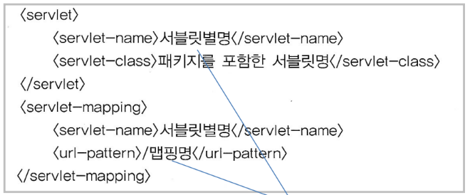
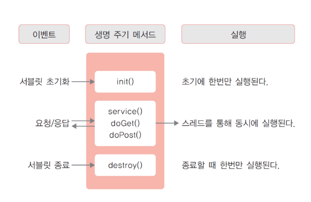

# Servlet / JSP 공부하는 공간

## 01.1 웹 어플리케이션 개요 ~ 01.2 웹 어플리케이션 프로젝트
> ### 프로젝트 만들기
> 
> - jakarta EE 선택
> - Template : Web application 선택
> - Application server : Tomcat 9 버전
> - Build System : Gradle
> - Version : Java EE 8 선택 (Servlet (4.0.1))

### 프로젝트 기본 구조
```
src
  └── main
       └── webapp 
              ├── WEB-INF
              |      ├── classes   ── class 파일
              |      ├── lib       ── jar 같은 라이브러리 파일
              |      └── web.xml
              |
              ├── JSP 파일
              └── 정적 리소스 (html, 이미지, css ...)
              
```

---

## 01.3 서블릿의 이해
> ### 서블릿 맵핑
> 
> - HelloServlet.java
> 
>   - 첫 번째 방법 : @WebServlet(name = "helloServlet", value = "/hello-servlet")
> - web.xml
> 
>   - 두 번째 방법 : 
> 

> ### 서블릿 아키텍처 및 핵심 API
> - 웹 컨테이너에서 서블릿을 실행
> - 결과값을 HTML로 구성하여 클라이언트에 응답
> 
> 
> - HTTP Request (요청)
>   - javax.servlet.http.HttpServletRequest
> - HTTP Response (응답)
>   - javax.servlet.http.HttpServletResponse
 
> ### 서블릿 LifeCycle 메소드
> #### 서블릿의 인스턴스를 init, service, destroy 메소드로 관리
> - init 메소드
>   - 인스턴스가 처음 실행될 때, 단 한 번 호출
>   - 서블릿에서 필요한 초기화 작업 시 사용
> - service 메소드
>   - 클라이언트가 요청할 때마다 호출
>   - doGet 또는 doPost에서 주로 작업
> - destroy 메소드
>   - 인스턴스가 웹 컨테이너에게 제거될 때 호출

> ### 서블릿의 생명 주기
> - 객체의 생성에서 종료에 이르는 과정
> 

> ### 서블릿 응답 처리
> #### 클라이언트에서 서블릿으로 요청
> #### 서블릿은 처리한 결과를 html 형식으로 응답 처리
> <br>
>
> ####  문자셋 설정 
> - response.setContentType("text/html;charset=UTF-8);
>   - 응답 데이터의 MIME 타입
> #### 응답 데이터의 전송
> - 문자 데이터 응답
>   - response.getWriter()로 PrintWriter 클래스 사용
> - 바이너리 데이터 응답
>   - response.getOutputStream()으로 ServletOutputStream 클래스 사용

---
